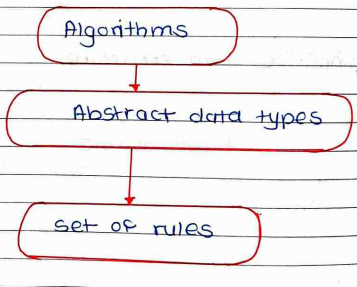

Data Structure

    Data structure is a way to store and organise data so that it can be used effectively.

    It is a set of algorithms that we can use in any programming language to structure data in memory.

## Types:

* Primitive data structures
  * int
  * char
  * float
  * double
  * pointer
* Non-primitive data structure
  * linear
  * non -linear

## Linear Data Structure:

    The arrangement of data in the sequential manner is known as linear data strucute.

**eg**. Arrays, linked list, stacks, queues.

## Non-Linear Data Structure:

    When one element is connected to the 'n' number of elements known as non -linear data structure.

**eg**. trees and graphs

## Algorithm and Abstract data types:

To structure the data in memory, 'n' number of algorithms are proposed and all these algorithms are known as abstract data types.

An abstract data type tells what is to be done and data structure tells how is to be done.

#### Data:

    Data can be defiined as the elementary vaue /collection of values.

eg. student's name and their id are data about the student.

#### Record:

    Record can be defined as collection of various data items.

    eg. student entity -> name, address, course and marks can be grouped together to form record.

#### File:

    File is a collection of various records of one type of entity.

    eg. if there are employees in class, then there will be 20 records in related to file where records contain info of employee.

#### Attribute and Entity:

    An entity represnts class of certain objects. it contains various attributes, each attribute represents particular property of that entiity.
